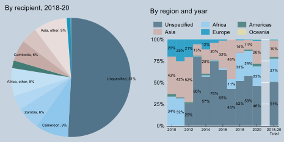
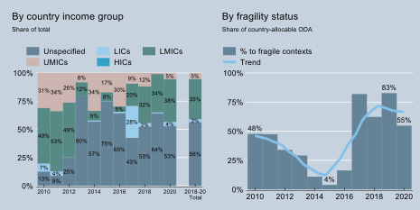

# Geographic Focus {-}

The majority of Germany’s ODA to data and statistics cannot be allocated to specific countries. Between 2018 and 2020, nearly half of Germany’s ODA to data and statistics were allocated to specific countries. For instance, the Federal Foreign Office supports IOM’s efforts to collect and analyse data on migratory movements in Yemen. In addition, the BMZ supports the modernisation of civil registration systems in Cameroon (Figure \@ref(fig:figure4)).

``` {r figure3, echo = F, fig.cap = 'Germany – country-allocable ODA to data and statistics, 2018 – 2020', fig.align = 'center', fig.topcaption=TRUE}

knitr::include_graphics("images/figures/Figure3.svg")

```
```Note: Based on gross disbursements. Hollow circles indicate relative share in total country-allocable gross disbursements.```

``` {r figure4, echo = F, fig.cap = 'Germany – ODA to data and statistics by recipients and region', fig.align = 'center', fig.topcaption=TRUE}



```
```Note: Based on share of total ODA gross disbursements.```

In terms of the allocation by recipient countries income group, 5% were disbursed to upper middle-income countries and 35% to lower middle-income countries (Figure \@ref(fig:figure5)). In addition, 55% of Germany’s country-allocable ODA to data and statistics is targeted to fragile countries in 2020.

``` {r figure5, echo = F, fig.cap = 'Germany – ODA to data and statistics by partner country characteristics, 2010 – 2020', fig.align = 'center', fig.topcaption=TRUE}



```
```Note: Based on share of total ODA gross disbursements. Left panel: LIC: low-income country; LMIC: lower middle-income country; UMIC: upper middle-income country; HIC: high-income country. Right panel: ODA: official development assistance. Based only on country-allocable official development assistance. The trend line is based on a local polynomial regression with a bandwidth of unity.  ```