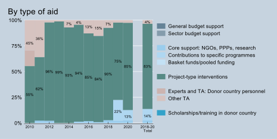

# Modalities and channels of delivery {-}

Between 2018 and 2020, most of Germany’s ODA to data and statistics was provided in the form of project-type interventions (83%) and pooled funding and contributions to specific programmes of implementing partners (14%) (Figure \@ref(fig:figure6)). 

``` {r figure6, echo = F, message = F, fig.cap = 'Germany – ODA to data and statistics by type of aid, 2010 – 2020', fig.align = "center"}

```


Between 2018 and 2020, Germany's support was channelled through public-sector entities in Germany and in partner countries (63%), research and teaching institutions (15%) and multilateral organisations (i.e. multi-bi; 19%), with key partners including the IMF, the FAO and the World Bank (Figure \@ref(fig:figure7)). There is an interesting trend in that support at the beginning of the decade was mainly channelled through public-sector entities, while multilateral organisations were the dominant channel in 2014-16. Support to research and teaching institutions increased thereafter. An important partner in this last category is the [Center for International Forestry Research](https://www.cifor.org/), a non-profit organisation that conducts scientific research on the use and management of forests.

``` {r figure7, echo = F, message = F, fig.cap = 'Germany – ODA to data and statistics by channel', fig.align = "center"}
knitr::include_graphics("images/figures/Figure7.svg")
```

:::: {.box data-latex=""}
::: {.center data-latex=""}
**Box 1. Germany – related documents and contacts**
:::

**Strategies, project documents, evaluations**

- BMZ (2021): *Digitalisierung als Innovationstreiber in der Entwicklungszusammenarbeit* (only available in German).

- BMZ (2020): [*BMZ 2030 reform strategy | New thinking -- new direction*](https://www.bmz.de/resource/blob/29026/a73123a6094263264e921881d6b76f90/Materialie520_BMZ%202030%20reform%20strategy)

- BMZ (2019):[*Digitalisierung für Entwicklung*](https://www.bmz.de/de/mediathek/publikationen/reihen/infobroschueren_flyer/infobroschueren/sMaterialie405_digitalisierung.pdf)* (engl: Digital technologies for development) -- Den digitalen Wandel gemeinsam gestalten (in German)*

- BMZ (2018): [*Development policy 2030 | New challenges -- new solutions*](https://www.bmz.de/en/news/publications/publikationen-reihen/strategiepapier452-10-2018-23770)

- GIZ, IDS, World Wide Web Foundation (2017): [*Data for development: What's next?*](http://webfoundation.org/docs/2018/01/Final_Data-for-development_Whats-next_Studie_EN.pdf)

- GIZ project (2018-21): [*Civil registration in Cameroon is being modernised*](https://www.giz.de/en/worldwide/87334.html)

- GIZ project: [*Digital change in development cooperation*](https://www.giz.de/en/worldwide/77334.html)

- GIZ Project: [*Support for national climate change adaptation plans in French-speaking sub-Saharan Africa*](https://www.giz.de/en/worldwide/61303.html)

- GIZ project (2016-24): [*An environmental registry is protecting the Amazon rainforest*](https://www.giz.de/en/worldwide/34060.html)

- GIZ project (2015-19): [*Integrated Biodiversity Management in the South Caucasus*](https://www.giz.de/en/worldwide/20319.html)

- [GIZ: Agenda 2030 Implementation Initiative](https://agenda2030giz-guide.de/files/giz/Dokumente/Factsheets%20Agenda%202030%20ENG/Factsheet06_2019%20Implementation%20Initiative_EN_Web.pdf#:~:text=With%20the%202030%20Implementation%20Initiative%2C%20which%20is%20realised,of%20the%202030%20Agenda%20at%20an%20early%20stage.)

- IOM: [*Global Migration Data Portal*](https://migrationdataportal.org/)

- FAO: [*Global Forest Survey*](http://www.fao.org/in-action/global-forest-survey/en/)

- FAO: [*Global Information System on Plant Genetic Resources for Food and Agriculture*](http://www.fao.org/plant-treaty/areas-of-work/global-information-system/en/) *(PGRFA)*

- IMF: [Data for Decisions (D4D) Fund](https://www.imf.org/en/Capacity-Development/D4D/d4d-fund)

- Partners for Review, Danish Institute for Human Rights and the International Civil Society Centre (2021): [*Lessons Learned Report: Advancing Inclusive SDG Data Partnerships*](https://www.partners-for-review.de/wp-content/uploads/2021/07/Inclusive-SDG-Data-Partnerships-Lessons-Learned-Report.pdf)

- Destatis (2016): *International co-operation* (in German). In: [Strategie- und Programmplan 2016-2020](https://www.statistischebibliothek.de/mir/servlets/MCRFileNodeServlet/DEHeft_derivate_00022292/StrategieProgrammplan2016_2020de.pdf;jsessionid=163E443EE5D34C450D456FC411F59AC2)

**Contact**

- BMZ, Governance unit
::::
