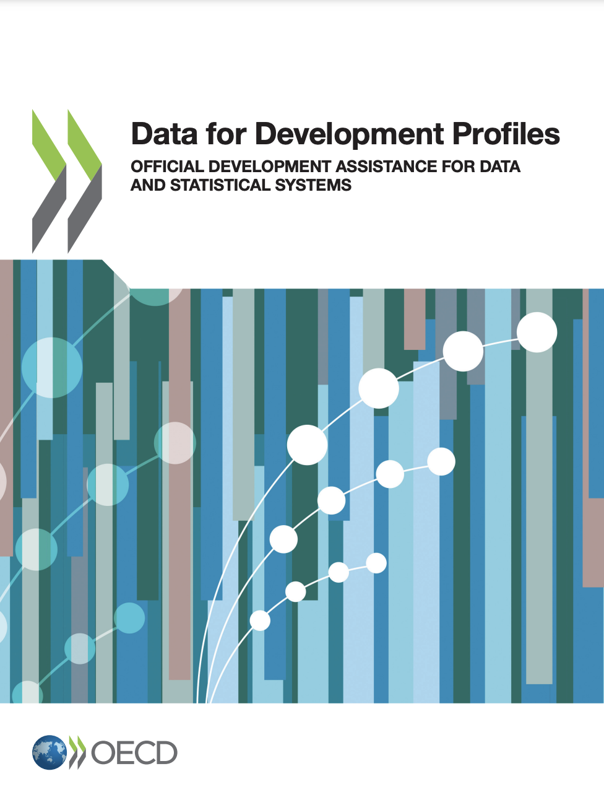

--- 
title: "Data for Development Profiles - Germany"
author: "Ida Mc Donnell and Fatoumata Ngom"
date: "December 2022"
description: "This Profile presents 2020 German ODA to data and statistics, and relevant charts, using the OECD D4D Profile methodology for Germany."
site: bookdown::bookdown_site
favicon: CH_circle.ico
output: 
  bookdown::html_document2:
    fig_caption: yes
    section_number: no
---

# Foreword and Acknowledgements {-}

In 2021, the OECD published first-ever [Data for Development (D4D) Profiles](https://www.oecd.org/dac/data-for-development-profiles-84baa8f3-en.htm) of 14 members of the Development Co-operation Committee (DAC), providing a comprehensive view of the current landscape of development co-operation and support for data and statistics, and insights on how members of the DAC members allocate official development assistance (ODA) to statistical capacity development and strengthening data ecosystems in low and middle income countries.

In 2022, the OECD Data for Development team has elaborated and added the D4D Profile for Germany (with the latest ODA data (2020)), thereby bringing to 15 the total number of DAC members with broad information on their statistical policy priorities, strategies, funding, delivery modalities and partnerships. 

This Profile has been drafted by Fatoumata Ngom (OECD) with guidance from Ida Mc Donnell (Team Lead OECD Data for Development). The Profile builds on the initial version prepared by Simon Lange (OECD) and benefited from collaboration with Yu Tian (PARIS21) and Deirdre Appel (Open Data Watch) for its publication and dissemination in the Clearing House for Financing Development Data.

``` {r d4dcover, echo = F, message = F, fig.align = "center"}

```

